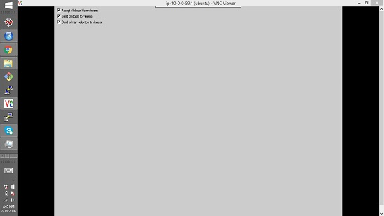

### There is no terminal and window-manager in VNC window.
You will see a gray window in VNC viewer and there is no terminal and window-manager.

### Method
Install gnome GUI tools:
```
sudo apt-get install gnome-panel gnome-settings-daemon metacity nautilus gnome-terminal
```

Edit the configure file under your home folder:
```
vi .vnc/xstartup
```

Copy following content to the file above:
```
#!/bin/sh

#Uncomment the following two lines for normal desktop:
#unset SESSION_MANAGER
#exec /etc/X11/xinit/xinitrc

[ -x /etc/vnc/xstartup ] && exec /etc/vnc/xstartup
[ -r $HOME/.Xresources ] && xrdb $HOME/.Xresources
xsetroot -solid grey
vncconfig -iconic &
x-terminal-emulator -geometry 80x24+10+10 -ls -title "$VNCDESKTOP Desktop" &
x-window-manager &
gnome-panel &
gnome-settings-daemon &
metacity &
nautilus &
```
### Start up vncserver in reboot

`crontab -e`

Add

`@reboot /usr/bin/vncserver :1`

### Install xfce4
```
sudo apt install xfce4 xfce4-goodies autocutsel xfce4-terminal xfonts-100dpi xfonts-75dpi
```

### Startup xfce4 in vncserver
`vi .vnc/xstartup`

Edit

```
#!/bin/bash

unset SESSION_MANAGER  
unset DBUS_SESSION_BUS_ADDRESS  
vncconfig -iconic &
autocutsel -fork
startxfce4 &  
[ -x /etc/vnc/xstartup ] && exec /etc/vnc/xstartup  
[ -r $HOME/.Xresources ] && xrdb $HOME/.Xresources  
xsetroot -solid grey  
```

### xfce4 in VNC tab is with problem
Application-> Menu -> Setttings -> Windows Manager

Select: Keyboard -> Switch window for same application

Click 'Clear'

### set xfce terminal as default --support copy/paste
sudo update-alternatives --config x-terminal-emulator

### minimize maximize buttons missing tightenvnc Ubuntu 20.04

Download xfwm4_4.14.5-1_amd64.deb from https://launchpad.net/ubuntu/groovy/amd64/xfwm4/4.14.5-1
```
wget http://launchpadlibrarian.net/494460182/xfwm4_4.14.5-1_amd64.deb
sudo dpkg -i xfwm4_4.14.5-1_amd64.deb
reboot
```
